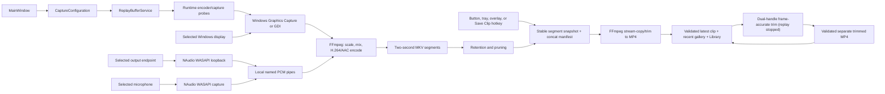

# ClipForge architecture

ClipForge is a Windows-only WPF application targeting `.NET 10` and `win-x64`. The application separates the WPF shell, persisted user choices, Windows device discovery, media-library indexing, and the FFmpeg-backed rolling capture engine so each can evolve independently.

## Design goals

- Keep a bounded, disk-backed replay window from 30 seconds to 1 hour.
- Save the most recent replay without interrupting ongoing capture.
- Keep capture media on the local PC and write to the clips folder only on an explicit save.
- Support one display plus optional desktop and microphone audio with explicit endpoint selection.
- Avoid requiring administrator rights, an account, a service, or a resident cloud component.
- Make missing FFmpeg a recoverable first-run setup step rather than a startup failure.
- Prefer a runtime-verified hardware encoder and low-overhead capture source while retaining safe compatibility fallbacks.
- Let the main window hide to the notification area while replay and global shortcuts remain available.
- Keep player, trim-export, and appearance work out of the capture-critical path, and avoid periodic whole-buffer scans.

ClipForge does not attempt a game-process hook, HDR pipeline, multi-track/effects editor, or upload service. Its editing boundary is a frame-accurate start/end trim in the local Library.

## Component map

| Area | Main types | Responsibility |
| --- | --- | --- |
| WPF shell | `MainWindow`, `LibraryWindow`, `OverlayWindow`, `App`, `Themes/Styles.xaml`, `NativeWindowThemeService`, `UiMotionService`, `ClipSavedSoundService` | Present the settings sidebar, replay controls, complete latest/full-library transport, dual-handle Library trim editor, All/Normal/Trimmed filtering, recent gallery, virtualized Library, compact overlay, native dark captions, bounded accessible motion, optional save feedback, and non-blocking error states. |
| Models | `AppSettings`, `CaptureConfiguration`, `HotkeyGesture`, `ClipLibraryItem`, option records, `ReplayStateSnapshot` | Separate serializable preferences and library views from the validated, immutable configuration used by a running capture. |
| Device discovery | `DeviceDiscoveryService` | Enumerate Windows displays and active render/capture audio endpoints. Displays come from WinForms `Screen`; audio endpoints come from NAudio/Core Audio. |
| Replay engine | `ReplayBufferService` and capture helpers under `Capture/` | Probe capture/encoder capabilities, own the tuned FFmpeg process, WASAPI audio producers, temporary segment set, retention policy, save snapshots, cancellation, and lifecycle state. |
| FFmpeg command construction | `FfmpegArgumentBuilder` | Build argument lists without shell interpolation for both continuous segment capture and MP4 creation. |
| FFmpeg provisioning | `FfmpegSetupService` | Resolve an existing FFmpeg installation or download a private copy on request. |
| Clip library and trim export | `ClipLibraryService`, the trim-export service, `ClipMediaProcessRunner`, `ThumbnailPathConverter` | Discover and classify top-level ClipForge-generated normal/trimmed MP4 files, validate local MOV/MP4 media, coalesce/cache identity-bound metadata probes, create/reuse bounded thumbnail decodes, supply the latest clip, selected 4/8/10/15-item gallery, and up-to-100-item Library, and transactionally create a separate validated trim. |
| Application updates | `AppUpdateService`, `ReleaseInfo`, Velopack | Check the configured release feed, download an update without interrupting capture, then explicitly apply it after the window shuts down cleanly. |
| Settings | `SettingsService` | Load JSON with safe defaults and atomically replace the settings file after changes. |
| Windows autostart | `AppLaunchOptions`, `StartupRegistrationService` | Parse the fixed private launch mode and own an opt-in per-user Startup shortcut for the installed package without introducing a service, scheduled task, or elevated process. |
| Shortcuts | `GlobalHotkeyService`, `HotkeyGesture` | Atomically register configurable Save Clip and Toggle Overlay combinations through the Win32 hotkey API and preserve working bindings on conflicts. |
| Tray lifecycle | `TrayIconService` | Keep window visibility separate from application/capture lifetime and expose Show, Save Clip, and Exit actions. |
| Process hardening | `ProcessSecurityService`, assembly DllImport policy | Restrict DLL lookup to trusted Windows/application/user search locations before native components are loaded. |
| Capacity guidance | `StorageEstimator` | Estimate the selected buffer's disk footprint from output dimensions, frame rate, duration, and audio. |

## Capture and save flow



### Starting replay

1. The UI resolves the selected option records into a `CaptureConfiguration` and validates the display, devices, replay duration, and save folder.
2. `FfmpegSetupService` supplies an executable path. Capture remains unavailable if FFmpeg is missing.
3. `FfmpegCapabilityProbe` executes short, real encode probes in priority order: NVIDIA NVENC, Intel Quick Sync, AMD AMF, then software H.264. A compiled-in encoder is not selected unless it succeeds with the active driver and requested format.
4. The engine tries direct FFmpeg Windows Graphics Capture and then a system-memory compatibility transfer for multi-GPU systems across every verified hardware encoder before accepting the first available hardware-plus-GDI fallback. Software H.264 remains the last compatibility path. Results are cached for that FFmpeg binary, display, resolution, and frame rate.
5. The engine creates an isolated temporary session directory and any named pipes needed for selected audio inputs.
6. NAudio opens the selected desktop loopback endpoint and/or microphone. Raw PCM is moved through bounded channels and written to the local pipes.
7. FFmpeg captures the selected display, consumes the PCM inputs, and writes sequential Matroska segments from a below-normal-priority child process.
8. Completed segments become eligible for saving. Old segments are removed so the retained duration stays bounded.

Long replay windows are disk-backed instead of being held in RAM. The clips folder is untouched until the user saves.

### Video and audio encoding

The capture command uses:

- The selected monitor index with FFmpeg `gfxcapture` when its runtime probe succeeds; otherwise the display's desktop coordinates and native dimensions with `gdigrab`.
- A scale/pad filter for fixed output presets, preserving aspect ratio and adding black padding when necessary. The GDI fallback explicitly uses the lower-cost `fast_bilinear` scaler so downscaling a native desktop to 720p does not pay the default software-scaling cost; Source mode only forces even dimensions and remains unscaled.
- H.264 through runtime-verified `h264_nvenc`, `h264_qsv`, or `h264_amf`; `libx264` remains the safe software fallback. Each encoder has low-impact settings appropriate to that implementation. NVENC uses the fast P2 preset, single-pass VBR, zero lookahead, and no B-frames to preserve foreground-game headroom.
- A forced keyframe and a new Matroska segment every two seconds.
- Optional WASAPI desktop loopback and microphone inputs, resampled to 48 kHz and mixed into one stereo track.
- AAC audio at 192 Kbps.

`gfxcapture` can keep compatible frames on the GPU for NVENC and AMF. When the capture and encoder devices differ, a runtime-probed compatibility strategy downloads BGRA frames before the verified hardware encoder; Quick Sync converts that transfer to NV12. Software capture downloads/converts to YUV420P. The selected strategy is exposed as `ReplayBufferService.ActiveEncoderDescription` and shown in the UI so compatibility fallbacks are visible rather than silent.

The FFmpeg capture process is assigned below-normal priority to reduce competition with interactive workloads. The software fallback also caps encoder worker threads. WASAPI producers keep at most 16 pooled sample blocks, preserve the newest audio if the writer falls behind, and promptly return dropped or shutdown-remnant buffers. The replay monitor follows the segment muxer's strictly increasing file names and keeps an incremental size/index view instead of enumerating and sorting the entire ring on every health poll. Media metadata and thumbnail helpers receive the same low-impact process priority. Identity-bound valid probe results use a bounded 512-entry cache, concurrent Recent/Library requests serialize and double-check that cache before launching a helper, and decoded thumbnails use a bounded 128-key weak cache. When a player window is hidden or inactive it cancels helper work, closes its media source, stops position timers, avoids full-control work on the one-second state tick, and updates only the small tray/overlay state that is actually visible. These measures reduce contention, disk metadata work, compositor work, and allocation pressure; they cannot guarantee a fixed input-latency result across games, drivers, and hardware.

Argument values are passed with `ProcessStartInfo.ArgumentList`; they are not concatenated into a command line for a shell. This is important for device names and user-selected paths.

### Saving a clip

The engine takes a stable snapshot of completed segments that overlap the requested replay window. It writes an FFmpeg concat manifest in temporary storage, trims excess time from the oldest selected segment, and remuxes the compatible H.264/AAC streams into an MP4 with `faststart` metadata. Capture can continue producing new segments while that save is running.

Stream copy avoids a second video encode. The two-second keyframe/segment cadence bounds seek granularity and makes completed segments independently manageable. Output names must be generated uniquely so repeated or concurrent saves never overwrite an earlier clip.

### Clip library and playback

After startup, a save, a trim, or a save-folder change, `ClipLibraryService` enumerates top-level files in the selected clips directory and sorts eligible candidates newest first. Eligibility requires either ClipForge's generated normal `Clip_YYYY-MM-DD_HH-mm-ss[_N].mp4` form or its distinct trimmed `Clip_YYYY-MM-DD_HH-mm-ss[_N]_trimmed[_N].mp4` form, as well as existing path, file-identity, reparse-point, and traversal checks. FFprobe is forced to the MOV/MP4 demuxer with a `file`-only protocol whitelist before a candidate is surfaced as playable media. This intentionally excludes unrelated or renamed MP4 files from automatic decoding; users can still open those files outside the gallery.

Thumbnail generation runs asynchronously through FFmpeg with the same local-file/MOV constraints, bounded output capture, cancellation, timeouts, one decode thread, and low-impact process priority. Cached thumbnails use a SHA-256 name bound to the clip path, metadata, Windows volume serial, and 128-bit file ID. A validated, non-writable/non-deletable clip handle and a pinned save-root handle remain open while FFmpeg reads by path and until the cache entry is committed, preventing a same-path file swap during decoding without copying the complete video. Atomic replacement prevents a crash from leaving a trusted partial entry, while cleanup pins and validates the cache-directory and thumbnail handles before deletion; loaded clips also prune their legacy v1.2 cache key. Frozen decoded JPEGs can be reused through weak references, so a rebind avoids redundant decoding without keeping image memory or files alive. The library is a local view over existing files; it does not copy or upload clips.

The large `MediaElement` surfaces provide play/pause, restart, clickable/draggable and keyboard seeking, elapsed/total time, 10-second backward/forward skips, mute, and volume. Playback is independent of replay capture. The recent gallery loads only the persisted 4/8/10/15-item limit, derives card width from both the requested limit and the number of clips actually found so a short row fills its viewport, displays the already-enumerated file size, and scrolls larger sets horizontally. **Library** loads up to the newest 100 validated clips into a recycling `VirtualizingStackPanel`; its All/Normal/Trimmed filter is applied to the classified candidates, and only the selected item is connected to a decoder. Because WPF manual media graphs do not always open from `Source` assignment alone, Library starts a muted prime and pauses in `MediaOpened` unless autoplay was requested. Hiding, deactivating, or closing either player clears its source and timer, and activation restores a remembered position without autoplay. Newer refresh requests cancel superseded probe/thumbnail work. Thumbnail JPEGs use `BitmapCacheOption.OnLoad` and frozen in-memory images, allowing deterministic cache files to be removed immediately. Right-click reveal and deletion revalidate ClipForge ownership and stable Windows volume/file identity; deletion rejects multi-link files, closes the selected media source, and uses a validated Windows handle. `UiMotionService` limits optional motion to short opacity/translation transitions, disables it for High Contrast, reduced-motion, or software-rendering conditions, and removes completed animation clocks.

### Trimming a Library clip

The Library exposes a two-handle range over the selected clip's timeline. Moving the start or end handle updates the local preview, and export re-encodes only that selected interval so the committed boundaries are frame-accurate rather than limited to the nearest H.264 keyframe. Trimming is available only while Instant Replay is stopped. The UI disables trim export while capture is starting, buffering, ready, saving, fault-recovering, or stopping so the trim encoder cannot compete with the capture-critical FFmpeg process.

Before export, the selected clip and save root are revalidated and held through pinned Windows handles. The local FFmpeg child receives a fully resolved trusted executable path, individual argument-list entries, a forced MOV/MP4 input demuxer, and a `file`-only protocol whitelist; it runs without a command shell at below-normal priority. A uniquely named partial is written in the destination directory, remains outside Library discovery, and is removed on cancellation or failure. ClipForge probes the completed partial and revalidates the pinned source/root before atomically committing it under a non-overwriting trimmed name. The original is never modified in place.

After the commit succeeds, the Library refreshes and selects the new trimmed clip. The default result is to keep both files. If the user explicitly accepts the follow-up deletion prompt, ClipForge revalidates the original's stable Windows identity and guarded deletion policy again; a changed, replaced, unsafe, or multi-link original is preserved instead of deleting a path that merely has the same name. Cancellation, FFmpeg failure, validation failure, or commit failure never triggers original deletion.

`NativeWindowThemeService` colors only the native non-client caption through supported DWM attributes, retaining Windows-managed minimize/maximize/close buttons, Snap Layouts, keyboard menus, DPI behavior, and accessibility. High Contrast resets these attributes to system defaults. `AppearanceThemePalette` validates the persisted background, accent, and surface choices, derives hover/pressed/border/gradient colors, constrains dark surfaces, and chooses black or white primary-button text for contrast. `ClipSavedSoundService` generates a short low-pitched PCM confirmation in memory, preloads it asynchronously, fails silently if an output device is unavailable, and plays only after `SaveClipAsync` returns a successful MP4 path. Its setting, toast, and sound do not share audio objects or timers with the replay capture pipeline.

### Shortcuts, tray, and overlay

`GlobalHotkeyService` owns two Win32 registrations: Save Clip and Toggle Overlay. Settings persist `HotkeyGesture` values, validation requires at least one modifier plus a non-modifier key, and both actions must be distinct. Re-registration is atomic: if Windows reports a conflict, the service restores the previous working registrations instead of leaving both actions unavailable.

Closing `MainWindow` hides it to the notification area. `TrayIconService` can reopen the window, request a save, or perform a real application exit. The global hotkeys and rolling buffer require the ClipForge process to remain alive; no Windows service or injected game component is installed. `OverlayWindow` is a small topmost opaque WPF surface for replay state and save/open controls; it avoids a layered transparent HWND and WPF drop shadow so the compositor has less work over a game. Its HWND handles `WM_MOUSEACTIVATE` with `MA_NOACTIVATE`, delivering pointer clicks without taking focus or relative-mouse ownership from a foreground game while avoiding the accessibility limitation of permanent `WS_EX_NOACTIVATE`; failed drag operations release WPF mouse capture. It can be shown or hidden from anywhere with the configured shortcut, but exclusive-fullscreen content can render above it.

`SingleInstanceService` scopes a named mutex and activation event to the current Windows user and logon session. A second launch sends only an activation signal and exits; the primary process restores its main window. This prevents two recorders from competing for the same hotkeys and devices. A legacy pre-v1.1 process is detected and must be exited once before the upgraded build starts.

`StartupRegistrationService` exposes the installed package's per-user Windows Startup shortcut as the **Start ClipForge and replay with Windows** preference. Registration is supported only when Velopack identifies the current non-portable package and its relative executable as `ClipForge.exe`; the shortcut receives only the fixed `--autostart` argument. `AppLaunchOptions` keeps manual launches interactive, starts an autostart launch in the background, and suppresses an accidental window raise when Windows invokes that argument while the primary instance is already alive. Replay is requested only after initialization has completed, the preference is still enabled, the local engine is ready, no replay is running, and shutdown has not begun. Disabling the preference deletes the shortcut, and the uninstall callback performs the same cleanup on a best-effort basis.

### Stopping and failure handling

Stopping cancels segment monitoring, asks FFmpeg to exit, terminates it if necessary, disposes audio capture and named-pipe resources, and removes the session directory. The UI consumes `ReplayStateSnapshot` values (`Stopped`, `Starting`, `Buffering`, `Ready`, `Saving`, `Faulted`, and `Stopping`) rather than inferring engine state from individual controls.

Unexpected device removal, a full disk, FFmpeg exit, or pipe failure transitions the session to a faulted/stopped state and surfaces a recoverable message. Process output should never be allowed to fill an unread redirected stream and deadlock capture.

## Configuration and local state

`AppSettings` is a tolerant serialization model. Missing, unsupported, malformed, or oversized JSON falls back to product defaults; settings input is capped at 1 MiB. `SettingsService` writes a uniquely named temporary file and atomically replaces the previous file, reducing the chance of partial JSON after a crash. The Windows autostart replay preference is off by default and is persisted locally alongside the other settings. Background, accent, and surface colors are stored as validated `#RRGGBB`. Invalid values use safe defaults; background and surface choices are proportionally darkened when necessary, and the derived palette supplies readable primary-button text and bounded interaction states.

| Item | Default location / source |
| --- | --- |
| Settings | `%LOCALAPPDATA%\ClipForge\settings.json` |
| FFmpeg tools | `%LOCALAPPDATA%\ClipForge\Tools\FFmpeg` |
| Saved normal clips, trimmed clips, and in-progress trim partials | `%USERPROFILE%\Videos\ClipForge` |
| Capture segments and concat manifests | `%LOCALAPPDATA%\ClipForge\Buffer\WindowsSession-<id>` in a per-capture directory managed by the replay engine |

`FfmpegSetupService` resolves and checksum-verifies the pinned `ffmpeg.exe`/`ffprobe.exe` pair in this order:

1. The private per-user tools directory.
2. Beside the application.
3. `Tools\FFmpeg` beside the application.

Arbitrary environment or `PATH` tools are disabled in normal operation. `CLIPFORGE_DEVELOPER_MODE=1` explicitly enables `CLIPFORGE_FFMPEG_PATH` and `PATH` discovery for source-level experiments; that mode intentionally bypasses the pinned executable policy and is not a production configuration.

On explicit install, the service requires a bounded Content-Length and sufficient free space, downloads the pinned Gyan.dev FFmpeg 8.1.2 essentials ZIP to a unique non-reparse staging directory, enforces hard streamed-byte and ZIP-entry size/compression-ratio ceilings, verifies the archive SHA-256, extracts only `ffmpeg.exe` and `ffprobe.exe`, and verifies both pinned executable SHA-256 values before and after installation. A mismatched or oversized response is rejected. The packaging script does not perform this download or redistribute FFmpeg.

## Installation and update lifecycle

Velopack packages ClipForge as a per-user Windows installer under the permanent package ID `ClipForge.Desktop`. This is intentionally different from the `%LOCALAPPDATA%\ClipForge` data directory so install and uninstall operations cannot replace settings, FFmpeg, or replay data.

Release builds use the permanent package identity/channel and semantic versions. The public update location is embedded at build time; an unconfigured developer build remains fully usable but does not make update requests. Stable installations exclude pre-releases, while a version containing a SemVer pre-release suffix includes later beta releases and can eventually move to the stable build. An installed, configured build can check its feed automatically or on demand, download the full or delta package, and stage it for restart.

Velopack's default implicit apply-on-startup path is disabled. Applying a staged update is scheduled only after the user selects **Restart to update**, before the window closes, so the existing shutdown path can stop FFmpeg, persist settings, and release the replay buffer first. This is an installation-timing and lifecycle control; it is not a publisher-authentication mechanism.

The release script emits the installer, portable ZIP, full update package, feed metadata, and SHA-256 manifest. The portable build is useful for testing but is not registered for automatic updates. Authenticode signing is optional at the release-script level for local testing, while the GitHub Actions workflow refuses to publish an unsigned public release. Publisher-owned signing credentials belong only in GitHub Actions secrets and are never committed to this repository.

Update sources are accepted only as HTTPS URLs without embedded credentials or as fully qualified local paths for development. A build without an embedded update source does not make update requests. Update application follows the same orderly shutdown path as a tray Exit, releasing capture and temporary resources before restart.

The current beta remains unsigned and the installed client does not pin a ClipForge project key or expected Authenticode publisher. HTTPS and Velopack package/feed checksums are useful integrity controls, but matching feed metadata can be replaced together with a package if the release account/feed is compromised. Trusted distribution therefore still requires an accepted signing route plus an enforced client-side trust policy; the unsigned beta must not be represented as a trusted stable updater.

## Process and input hardening

ClipForge runs as the signed-in user with `asInvoker` and does not request elevation. Startup calls the restricted Windows DLL directory policy before native capture or updater components load; assembly-level DllImport policy limits native resolution to the application directory, Windows system directory, and explicitly added user directories.

The optional Windows autostart path is a per-user installed-package Startup shortcut rather than a service, Run-key entry, or scheduled task. Its executable name and argument are fixed in code; unsupported portable/development contexts cannot enable it. An autostart command line cannot inject an arbitrary target or argument through persisted settings.

FFmpeg and FFprobe are launched by fully resolved executable path with `UseShellExecute=false`, no command shell, and individual argument-list entries. Normal builds accept only the pinned private/bundled executable hashes. Media probe, thumbnail, and trim processes accept only ClipForge-generated top-level candidates, revalidate file identity immediately before use, force MOV/MP4 demuxing with the local `file` protocol, cap helper runtime and diagnostic output, honor cancellation, and terminate their child process on timeout. Trim export additionally pins the source and destination root, writes an undiscoverable unique partial, validates it before an atomic non-overwriting commit, and revalidates the original before any optional deletion. WASAPI named pipes are restricted to the current user. Replay roots are separated by Windows logon-session ID; cleanup rejects a root when it or an existing ancestor is a reparse point, accepts only a regular direct `session-*` child, and purges abandoned sessions in the current logon scope after single-instance ownership is established on the next launch. User-facing Open actions accept only fully qualified existing local paths. The optional FFmpeg installer uses bounded download/extraction, a pinned HTTPS archive digest, and pinned hashes for both extracted executables.

These controls reduce DLL preloading, command injection, path traversal, resource-exhaustion, and update-feed mistakes. They do not protect recordings from malware already running as the same user, an administrator, a kernel driver, or a compromised Windows installation. Authenticode establishes publisher identity and file integrity; it is not a substitute for secure implementation and operating-system hygiene.

## Privacy boundary

No media path leads to a ClipForge server: the application has no account, analytics, telemetry, cloud, or upload component. Screen and audio data, normal clips, trim selections, trim partials, and trimmed outputs stay within the WPF process, its NAudio capture instances, local named pipes, local FFmpeg child processes, temporary disk storage, and the user-selected output folder.

App-initiated network requests are limited to the user-triggered FFmpeg install and, in a release build with an update source, release-feed checks and update-package downloads. These requests do not contain captured media. A save folder controlled by another synchronization product is outside this boundary and may be uploaded by that product.

## Storage model

The UI estimate uses:

```text
video_bps = clamp(width * height * fps * 0.14, 3,000,000, 55,000,000)
audio_bps = 192,000 when any audio is enabled, otherwise 0
bytes     = (video_bps + audio_bps) * seconds / 8
```

This is capacity guidance, not a quota. CRF encoding varies with content, and the user needs extra space while a saved MP4 coexists with the rolling segments. Trim export likewise needs room for the normal source, an in-progress partial, and the separately committed trimmed MP4 until the user optionally confirms original deletion. Segment pruning must be based on completed media only; deleting the segment FFmpeg is still writing can corrupt the session.

## Concurrency and ownership rules

- One engine instance owns at most one capture session and one FFmpeg capture process.
- Capture configuration is immutable for the life of a session. The UI automatically performs stop/start when display, resolution, frame-rate, or audio choices change; retention changes apply in place.
- Start and stop are serialized and cancellation-aware.
- Saving uses a snapshot of completed segments and does not mutate the active segment set.
- Trim export is single-flight and is disabled until replay has stopped; capture and trim encoders never intentionally run together.
- Trim output is committed as a separate file. The selected source and destination root stay pinned through validation and commit, and optional original deletion is a later identity-revalidated action.
- Temporary files have one clear owner and are removed on normal completion or cancellation; cleanup after abnormal process or machine termination is best-effort.
- UI changes and progress events are marshalled back to the WPF dispatcher.

These rules prevent overlapping capture processes, use-after-delete races during save, and cross-thread WPF access.

## Known constraints

- Windows Graphics Capture or GDI records the desktop compositor rather than hooking a game's render pipeline. It targets desktop, windowed, and borderless content; exclusive-fullscreen games can fail or appear black.
- Protected/DRM surfaces and some hardware overlays cannot be captured.
- The pipeline is SDR, 8-bit `yuv420p`; HDR/10-bit metadata and tone mapping are not preserved.
- Hardware encoders depend on current drivers and runtime support. If every hardware probe fails, `libx264` is CPU-based and 1440p/2160p or 60 FPS may be too expensive on some systems.
- There is one selected display and one mixed stereo audio track. Region/window capture, per-app audio, separate tracks, and independent gain controls are not part of the current release.
- Audio device removal or format changes during a session may require replay to be restarted.
- The overlay is a desktop WPF window, not a game-injected overlay. Windows autostart is an optional per-user installed-app shortcut, not a service; replay therefore still requires the signed-in user's ClipForge and FFmpeg processes to remain running. There is no multi-track/effects editor or automatic upload, and editing is limited to a start/end Library trim.
- Trim export requires replay to be stopped and re-encodes the selected interval. Below-normal process priority and single-flight scheduling reduce foreground contention but cannot make a long or high-resolution trim instantaneous or resource-free.
- The performance smoke test validates real segment rollover, a saved MP4, duration, encoder/process priority, and sampled resource use on the test machine. It cannot certify zero input delay for every game/GPU/driver combination; target-game testing remains a release check.
- The current beta is unsigned, and the installed updater does not yet enforce a pinned publisher identity. Signing and a client-side update trust policy remain release/security work rather than completed protection.

## Extension points

The next high-value engine changes are explicit free-space enforcement, separate-track audio, per-application audio, and a game-aware capture mode. They can be introduced behind the replay-engine boundary while preserving the option models, settings service, clip library, global shortcuts, Windows autostart boundary, and most of the WPF flow.
