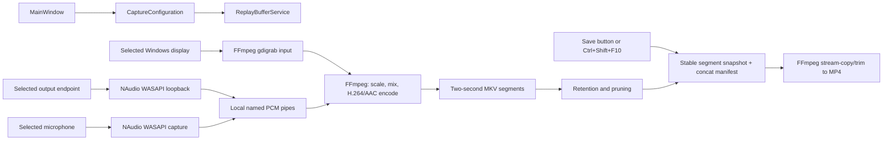

# ClipForge architecture

ClipForge is a Windows-only WPF application targeting `.NET 10` and `win-x64`. The MVP deliberately separates the WPF shell, persisted user choices, Windows device discovery, and the FFmpeg-backed rolling capture engine so each can evolve independently.

## Design goals

- Keep a bounded, disk-backed replay window from 30 seconds to 1 hour.
- Save the most recent replay without interrupting ongoing capture.
- Keep capture media on the local PC and write to the clips folder only on an explicit save.
- Support one display plus optional desktop and microphone audio with explicit endpoint selection.
- Avoid requiring administrator rights, an account, a service, or a resident cloud component.
- Make missing FFmpeg a recoverable first-run setup step rather than a startup failure.

The MVP does not attempt a game-process hook, HDR pipeline, GPU encoder abstraction, editor, or upload service.

## Component map

| Area | Main types | Responsibility |
| --- | --- | --- |
| WPF shell | `MainWindow`, `App`, `Themes/Styles.xaml` | Present capture status and settings, translate button and shortcut actions into asynchronous engine operations, and keep error states non-blocking. |
| Models | `AppSettings`, `CaptureConfiguration`, option records, `ReplayStateSnapshot` | Separate serializable preferences from the validated, immutable configuration used by a running capture. |
| Device discovery | `DeviceDiscoveryService` | Enumerate Windows displays and active render/capture audio endpoints. Displays come from WinForms `Screen`; audio endpoints come from NAudio/Core Audio. |
| Replay engine | `ReplayBufferService` and capture helpers under `Capture/` | Own the FFmpeg process, WASAPI audio producers, temporary segment set, retention policy, save snapshots, cancellation, and lifecycle state. |
| FFmpeg command construction | `FfmpegArgumentBuilder` | Build argument lists without shell interpolation for both continuous segment capture and MP4 creation. |
| FFmpeg provisioning | `FfmpegSetupService` | Resolve an existing FFmpeg installation or download a private copy on request. |
| Application updates | `AppUpdateService`, `ReleaseInfo`, Velopack | Check the configured stable release feed, download an update without interrupting capture, then apply it after the window shuts down cleanly. |
| Settings | `SettingsService` | Load JSON with safe defaults and atomically replace the settings file after changes. |
| Shortcut | `GlobalHotkeyService` | Register/unregister Ctrl+Shift+F10 through the Win32 hotkey API and raise a managed event. |
| Capacity guidance | `StorageEstimator` | Estimate the selected buffer's disk footprint from output dimensions, frame rate, duration, and audio. |

## Capture and save flow



### Starting replay

1. The UI resolves the selected option records into a `CaptureConfiguration` and validates the display, devices, replay duration, and save folder.
2. `FfmpegSetupService` supplies an executable path. Capture remains unavailable if FFmpeg is missing.
3. The engine creates an isolated temporary session directory and any named pipes needed for selected audio inputs.
4. NAudio opens the selected desktop loopback endpoint and/or microphone. Raw PCM is written to the local pipes.
5. FFmpeg captures the selected display through `gdigrab`, consumes the PCM inputs, and writes sequential Matroska segments.
6. Completed segments become eligible for saving. Old segments are removed so the retained duration stays bounded.

Long replay windows are disk-backed instead of being held in RAM. The clips folder is untouched until the user saves.

### Video and audio encoding

The capture command currently uses:

- The selected display's desktop coordinates and native dimensions as the `gdigrab` input.
- A scale/pad filter for fixed output presets, preserving aspect ratio and adding black padding when necessary. Source mode only forces even dimensions.
- H.264 through `libx264`, `veryfast`, CRF 23, constant selected frame rate, and `yuv420p` output.
- A forced keyframe and a new Matroska segment every two seconds.
- Optional WASAPI desktop loopback and microphone inputs, resampled to 48 kHz and mixed into one stereo track.
- AAC audio at 192 Kbps.

Argument values are passed with `ProcessStartInfo.ArgumentList`; they are not concatenated into a command line for a shell. This is important for device names and user-selected paths.

### Saving a clip

The engine takes a stable snapshot of completed segments that overlap the requested replay window. It writes an FFmpeg concat manifest in temporary storage, trims excess time from the oldest selected segment, and remuxes the compatible H.264/AAC streams into an MP4 with `faststart` metadata. Capture can continue producing new segments while that save is running.

Stream copy avoids a second video encode. The two-second keyframe/segment cadence bounds seek granularity and makes completed segments independently manageable. Output names must be generated uniquely so repeated or concurrent saves never overwrite an earlier clip.

### Stopping and failure handling

Stopping cancels segment monitoring, asks FFmpeg to exit, terminates it if necessary, disposes audio capture and named-pipe resources, and removes the session directory. The UI consumes `ReplayStateSnapshot` values (`Stopped`, `Starting`, `Buffering`, `Ready`, `Saving`, `Faulted`, and `Stopping`) rather than inferring engine state from individual controls.

Unexpected device removal, a full disk, FFmpeg exit, or pipe failure transitions the session to a faulted/stopped state and surfaces a recoverable message. Process output should never be allowed to fill an unread redirected stream and deadlock capture.

## Configuration and local state

`AppSettings` is a tolerant serialization model. Missing, unsupported, or malformed JSON falls back to product defaults. `SettingsService` writes a uniquely named temporary file and atomically replaces the previous file, reducing the chance of partial JSON after a crash.

| Item | Default location / source |
| --- | --- |
| Settings | `%LOCALAPPDATA%\ClipForge\settings.json` |
| FFmpeg tools | `%LOCALAPPDATA%\ClipForge\Tools\FFmpeg` |
| Saved clips | `%USERPROFILE%\Videos\ClipForge` |
| Capture segments and concat manifests | `%LOCALAPPDATA%\ClipForge\Buffer` in a per-session directory managed by the replay engine |

`FfmpegSetupService` resolves `ffmpeg.exe` in this order:

1. `CLIPFORGE_FFMPEG_PATH`, as either an executable or a directory.
2. The private per-user tools directory.
3. Beside the application.
4. `Tools\FFmpeg` beside the application.
5. Directories on `PATH`.

On explicit install, it downloads the pinned Gyan.dev FFmpeg 8.1.2 essentials ZIP to a unique staging directory, verifies its SHA-256 digest, extracts only `ffmpeg.exe` and `ffprobe.exe`, moves them into the private tools directory, and removes staging data. A mismatched archive is rejected before extraction. The packaging script does not perform this download or redistribute FFmpeg.

## Installation and update lifecycle

Velopack packages ClipForge as a per-user Windows installer under the permanent package ID `ClipForge.Desktop`. This is intentionally different from the `%LOCALAPPDATA%\ClipForge` data directory so install and uninstall operations cannot replace settings, FFmpeg, or replay data.

Release builds use the `stable` channel and semantic versions. The public update location is embedded at build time; an unconfigured developer build remains fully usable but does not make update requests. An installed, configured build can check its feed automatically or on demand, download the full or delta package, and stage it for restart. Applying an update is scheduled before the window closes so the existing shutdown path can stop FFmpeg, persist settings, and release the replay buffer first.

The release script emits the installer, portable archive, full update package, feed metadata, and SHA-256 manifest. Authenticode signing is optional at the script level for local testing but required for a trusted public release.

## Privacy boundary

No media path leads to a ClipForge server: the application has no account, analytics, telemetry, cloud, or upload component. Screen and audio data stay within the WPF process, its NAudio capture instances, local named pipes, the local FFmpeg child process, temporary disk segments, and the user-selected output folder.

App-initiated network requests are limited to the user-triggered FFmpeg install and, in a release build with an update source, release-feed checks and update-package downloads. These requests do not contain captured media. A save folder controlled by another synchronization product is outside this boundary and may be uploaded by that product.

## Storage model

The UI estimate uses:

```text
video_bps = clamp(width * height * fps * 0.14, 3,000,000, 55,000,000)
audio_bps = 192,000 when any audio is enabled, otherwise 0
bytes     = (video_bps + audio_bps) * seconds / 8
```

This is capacity guidance, not a quota. CRF encoding varies with content, and the user needs extra space while a saved MP4 coexists with the rolling segments. Segment pruning must be based on completed media only; deleting the segment FFmpeg is still writing can corrupt the session.

## Concurrency and ownership rules

- One engine instance owns at most one capture session and one FFmpeg capture process.
- Capture configuration is immutable for the life of a session. The UI automatically performs stop/start when display, resolution, frame-rate, or audio choices change; retention changes apply in place.
- Start and stop are serialized and cancellation-aware.
- Saving uses a snapshot of completed segments and does not mutate the active segment set.
- Temporary files have one clear owner and are removed on normal completion; cleanup after abnormal termination is best-effort.
- UI changes and progress events are marshalled back to the WPF dispatcher.

These rules prevent overlapping capture processes, use-after-delete races during save, and cross-thread WPF access.

## Known MVP constraints

- `gdigrab` records the desktop compositor rather than hooking a game's render pipeline. It targets desktop, windowed, and borderless content; exclusive-fullscreen games can fail or appear black.
- Protected/DRM surfaces and some hardware overlays cannot be captured.
- The pipeline is SDR, 8-bit `yuv420p`; HDR/10-bit metadata and tone mapping are not preserved.
- `libx264` is CPU-based. 1440p/2160p and 60 FPS may be too expensive on some systems.
- There is one selected display and one mixed stereo audio track. Region/window capture, per-app audio, separate tracks, and independent gain controls are not part of the MVP.
- Audio device removal or format changes during a session may require replay to be restarted.
- There is no tray agent, startup task, in-game overlay, clip editor/library, or automatic upload. Trusted code signing and public update hosting are release-operations responsibilities and require publisher-owned credentials and infrastructure.

## Extension points

The next high-value engine changes are a Windows Graphics Capture source, hardware encoder capability detection (NVENC/AMF/Quick Sync), a separate-track audio mode, and explicit free-space enforcement. They can be introduced behind the replay-engine boundary while preserving the option models, settings service, global shortcut, and most of the WPF flow.
