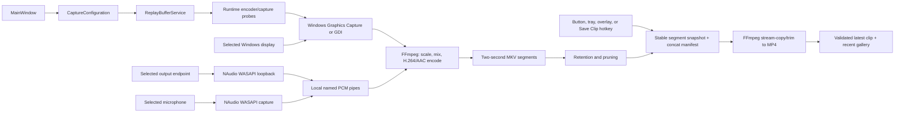

# ClipForge architecture

ClipForge is a Windows-only WPF application targeting `.NET 10` and `win-x64`. The application separates the WPF shell, persisted user choices, Windows device discovery, media-library indexing, and the FFmpeg-backed rolling capture engine so each can evolve independently.

## Design goals

- Keep a bounded, disk-backed replay window from 30 seconds to 1 hour.
- Save the most recent replay without interrupting ongoing capture.
- Keep capture media on the local PC and write to the clips folder only on an explicit save.
- Support one display plus optional desktop and microphone audio with explicit endpoint selection.
- Avoid requiring administrator rights, an account, a service, or a resident cloud component.
- Make missing FFmpeg a recoverable first-run setup step rather than a startup failure.
- Prefer a runtime-verified hardware encoder and low-overhead capture source while retaining safe compatibility fallbacks.
- Let the main window hide to the notification area while replay and global shortcuts remain available.

Version 1.1 does not attempt a game-process hook, HDR pipeline, editor, or upload service.

## Component map

| Area | Main types | Responsibility |
| --- | --- | --- |
| WPF shell | `MainWindow`, `OverlayWindow`, `App`, `Themes/Styles.xaml` | Present the settings sidebar, replay controls, latest-clip player, recent gallery, compact overlay, animations, and non-blocking error states. |
| Models | `AppSettings`, `CaptureConfiguration`, `HotkeyGesture`, `ClipLibraryItem`, option records, `ReplayStateSnapshot` | Separate serializable preferences and library views from the validated, immutable configuration used by a running capture. |
| Device discovery | `DeviceDiscoveryService` | Enumerate Windows displays and active render/capture audio endpoints. Displays come from WinForms `Screen`; audio endpoints come from NAudio/Core Audio. |
| Replay engine | `ReplayBufferService` and capture helpers under `Capture/` | Probe capture/encoder capabilities, own the tuned FFmpeg process, WASAPI audio producers, temporary segment set, retention policy, save snapshots, cancellation, and lifecycle state. |
| FFmpeg command construction | `FfmpegArgumentBuilder` | Build argument lists without shell interpolation for both continuous segment capture and MP4 creation. |
| FFmpeg provisioning | `FfmpegSetupService` | Resolve an existing FFmpeg installation or download a private copy on request. |
| Clip library | `ClipLibraryService`, `ClipMediaProcessRunner` | Discover recent top-level MP4 files, validate media, create cached thumbnails, and supply the latest clip plus four gallery items. |
| Application updates | `AppUpdateService`, `ReleaseInfo`, Velopack | Check the configured stable release feed, download an update without interrupting capture, then apply it after the window shuts down cleanly. |
| Settings | `SettingsService` | Load JSON with safe defaults and atomically replace the settings file after changes. |
| Shortcuts | `GlobalHotkeyService`, `HotkeyGesture` | Atomically register configurable Save Clip and Toggle Overlay combinations through the Win32 hotkey API and preserve working bindings on conflicts. |
| Tray lifecycle | `TrayIconService` | Keep window visibility separate from application/capture lifetime and expose Show, Save Clip, and Exit actions. |
| Process hardening | `ProcessSecurityService`, assembly DllImport policy | Restrict DLL lookup to trusted Windows/application/user search locations before native components are loaded. |
| Capacity guidance | `StorageEstimator` | Estimate the selected buffer's disk footprint from output dimensions, frame rate, duration, and audio. |

## Capture and save flow



### Starting replay

1. The UI resolves the selected option records into a `CaptureConfiguration` and validates the display, devices, replay duration, and save folder.
2. `FfmpegSetupService` supplies an executable path. Capture remains unavailable if FFmpeg is missing.
3. `FfmpegCapabilityProbe` executes short, real encode probes in priority order: NVIDIA NVENC, Intel Quick Sync, AMD AMF, then software H.264. A compiled-in encoder is not selected unless it succeeds with the active driver and requested format.
4. For the selected encoder, the engine probes direct FFmpeg Windows Graphics Capture, then Windows Graphics Capture with a system-memory compatibility transfer for multi-GPU systems, and finally GDI compatibility capture. Results are cached for that FFmpeg binary, display, resolution, and frame rate.
5. The engine creates an isolated temporary session directory and any named pipes needed for selected audio inputs.
6. NAudio opens the selected desktop loopback endpoint and/or microphone. Raw PCM is moved through bounded channels and written to the local pipes.
7. FFmpeg captures the selected display, consumes the PCM inputs, and writes sequential Matroska segments from a below-normal-priority child process.
8. Completed segments become eligible for saving. Old segments are removed so the retained duration stays bounded.

Long replay windows are disk-backed instead of being held in RAM. The clips folder is untouched until the user saves.

### Video and audio encoding

The capture command uses:

- The selected monitor index with FFmpeg `gfxcapture` when its runtime probe succeeds; otherwise the display's desktop coordinates and native dimensions with `gdigrab`.
- A scale/pad filter for fixed output presets, preserving aspect ratio and adding black padding when necessary. Source mode only forces even dimensions.
- H.264 through runtime-verified `h264_nvenc`, `h264_qsv`, or `h264_amf`; `libx264` remains the safe software fallback. Each encoder has low-latency/quality settings appropriate to that implementation.
- A forced keyframe and a new Matroska segment every two seconds.
- Optional WASAPI desktop loopback and microphone inputs, resampled to 48 kHz and mixed into one stereo track.
- AAC audio at 192 Kbps.

`gfxcapture` can keep compatible frames on the GPU for NVENC and AMF. When the capture and encoder devices differ, a runtime-probed compatibility strategy downloads BGRA frames before the verified hardware encoder; Quick Sync converts that transfer to NV12. Software capture downloads/converts to YUV420P. The selected strategy is exposed as `ReplayBufferService.ActiveEncoderDescription` and shown in the UI so compatibility fallbacks are visible rather than silent.

The FFmpeg capture process is assigned below-normal priority to reduce competition with interactive workloads. The software fallback also caps encoder worker threads, and WASAPI producers use bounded pooled buffers. These measures reduce contention and prevent an unbounded audio backlog; they cannot guarantee a fixed input-latency result across games, drivers, and hardware.

Argument values are passed with `ProcessStartInfo.ArgumentList`; they are not concatenated into a command line for a shell. This is important for device names and user-selected paths.

### Saving a clip

The engine takes a stable snapshot of completed segments that overlap the requested replay window. It writes an FFmpeg concat manifest in temporary storage, trims excess time from the oldest selected segment, and remuxes the compatible H.264/AAC streams into an MP4 with `faststart` metadata. Capture can continue producing new segments while that save is running.

Stream copy avoids a second video encode. The two-second keyframe/segment cadence bounds seek granularity and makes completed segments independently manageable. Output names must be generated uniquely so repeated or concurrent saves never overwrite an earlier clip.

### Clip library and playback

After startup, a save, or a save-folder change, `ClipLibraryService` enumerates top-level `.mp4` files in the selected clips directory and sorts them newest first. It returns the latest clip for the large WPF `MediaElement` player and up to four recent items for the gallery. Enumeration rejects reparse-point and path-traversal cases, and FFprobe validates each candidate before it is surfaced as playable media.

Thumbnail generation runs asynchronously through FFmpeg with bounded output capture, cancellation, and timeouts. Cached thumbnails use a content-derived SHA-256 name and atomic replacement so a crash cannot leave a trusted partial cache entry. The library is a local view over existing files; it does not copy or upload clips.

### Shortcuts, tray, and overlay

`GlobalHotkeyService` owns two Win32 registrations: Save Clip and Toggle Overlay. Settings persist `HotkeyGesture` values, validation requires at least one modifier plus a non-modifier key, and both actions must be distinct. Re-registration is atomic: if Windows reports a conflict, the service restores the previous working registrations instead of leaving both actions unavailable.

Closing `MainWindow` hides it to the notification area. `TrayIconService` can reopen the window, request a save, or perform a real application exit. The global hotkeys and rolling buffer require the ClipForge process to remain alive; no Windows service or injected game component is installed. `OverlayWindow` is a small topmost WPF surface for replay state and save/open controls. It can be shown or hidden from anywhere with the configured shortcut, but exclusive-fullscreen content can render above it.

`SingleInstanceService` scopes a named mutex and activation event to the current Windows user and logon session. A second v1.1 launch sends only an activation signal and exits; the primary process restores its main window. This prevents two recorders from competing for the same hotkeys and devices. A legacy pre-v1.1 process is detected and must be exited once before the upgraded build starts.

### Stopping and failure handling

Stopping cancels segment monitoring, asks FFmpeg to exit, terminates it if necessary, disposes audio capture and named-pipe resources, and removes the session directory. The UI consumes `ReplayStateSnapshot` values (`Stopped`, `Starting`, `Buffering`, `Ready`, `Saving`, `Faulted`, and `Stopping`) rather than inferring engine state from individual controls.

Unexpected device removal, a full disk, FFmpeg exit, or pipe failure transitions the session to a faulted/stopped state and surfaces a recoverable message. Process output should never be allowed to fill an unread redirected stream and deadlock capture.

## Configuration and local state

`AppSettings` is a tolerant serialization model. Missing, unsupported, malformed, or oversized JSON falls back to product defaults; settings input is capped at 1 MiB. `SettingsService` writes a uniquely named temporary file and atomically replaces the previous file, reducing the chance of partial JSON after a crash.

| Item | Default location / source |
| --- | --- |
| Settings | `%LOCALAPPDATA%\ClipForge\settings.json` |
| FFmpeg tools | `%LOCALAPPDATA%\ClipForge\Tools\FFmpeg` |
| Saved clips | `%USERPROFILE%\Videos\ClipForge` |
| Capture segments and concat manifests | `%LOCALAPPDATA%\ClipForge\Buffer` in a per-session directory managed by the replay engine |

`FfmpegSetupService` resolves `ffmpeg.exe` in this order:

1. `CLIPFORGE_FFMPEG_PATH`, as either an executable or a directory.
2. The private per-user tools directory.
3. Beside the application.
4. `Tools\FFmpeg` beside the application.
5. Directories on `PATH`.

On explicit install, it downloads the pinned Gyan.dev FFmpeg 8.1.2 essentials ZIP to a unique staging directory, verifies its SHA-256 digest, extracts only `ffmpeg.exe` and `ffprobe.exe`, moves them into the private tools directory, and removes staging data. A mismatched archive is rejected before extraction. The packaging script does not perform this download or redistribute FFmpeg.

## Installation and update lifecycle

Velopack packages ClipForge as a per-user Windows installer under the permanent package ID `ClipForge.Desktop`. This is intentionally different from the `%LOCALAPPDATA%\ClipForge` data directory so install and uninstall operations cannot replace settings, FFmpeg, or replay data.

Release builds use the `stable` channel and semantic versions. The public update location is embedded at build time; an unconfigured developer build remains fully usable but does not make update requests. An installed, configured build can check its feed automatically or on demand, download the full or delta package, and stage it for restart. Applying an update is scheduled before the window closes so the existing shutdown path can stop FFmpeg, persist settings, and release the replay buffer first.

The release script emits the installer, portable ZIP, full update package, feed metadata, and SHA-256 manifest. The portable build is useful for testing but is not registered for automatic updates. Authenticode signing is optional at the release-script level for local testing, while the GitHub Actions workflow refuses to publish an unsigned public release. Publisher-owned signing credentials belong only in GitHub Actions secrets and are never committed to this repository.

Update sources are accepted only as HTTPS URLs without embedded credentials or as fully qualified local paths for development. A build without an embedded update source does not make update requests. Update application follows the same orderly shutdown path as a tray Exit, releasing capture and temporary resources before restart.

## Process and input hardening

ClipForge runs as the signed-in user with `asInvoker` and does not request elevation. Startup calls the restricted Windows DLL directory policy before native capture or updater components load; assembly-level DllImport policy limits native resolution to the application directory, Windows system directory, and explicitly added user directories.

FFmpeg and FFprobe are launched by fully resolved executable path with `UseShellExecute=false`, no command shell, and individual argument-list entries. Media probe/thumbnail processes bound diagnostic output, enforce timeouts, honor cancellation, and terminate their child process on timeout. WASAPI named pipes are restricted to the current user, and replay cleanup refuses reparse points or any directory outside a direct `session-*` child of the buffer root. User-facing Open actions accept only fully qualified existing local paths. The optional FFmpeg installer accepts a pinned HTTPS archive, verifies its SHA-256 digest, and extracts only the expected executables.

These controls reduce DLL preloading, command injection, path traversal, resource-exhaustion, and update-feed mistakes. They do not protect recordings from malware already running as the same user, an administrator, a kernel driver, or a compromised Windows installation. Authenticode establishes publisher identity and file integrity; it is not a substitute for secure implementation and operating-system hygiene.

## Privacy boundary

No media path leads to a ClipForge server: the application has no account, analytics, telemetry, cloud, or upload component. Screen and audio data stay within the WPF process, its NAudio capture instances, local named pipes, the local FFmpeg child process, temporary disk segments, and the user-selected output folder.

App-initiated network requests are limited to the user-triggered FFmpeg install and, in a release build with an update source, release-feed checks and update-package downloads. These requests do not contain captured media. A save folder controlled by another synchronization product is outside this boundary and may be uploaded by that product.

## Storage model

The UI estimate uses:

```text
video_bps = clamp(width * height * fps * 0.14, 3,000,000, 55,000,000)
audio_bps = 192,000 when any audio is enabled, otherwise 0
bytes     = (video_bps + audio_bps) * seconds / 8
```

This is capacity guidance, not a quota. CRF encoding varies with content, and the user needs extra space while a saved MP4 coexists with the rolling segments. Segment pruning must be based on completed media only; deleting the segment FFmpeg is still writing can corrupt the session.

## Concurrency and ownership rules

- One engine instance owns at most one capture session and one FFmpeg capture process.
- Capture configuration is immutable for the life of a session. The UI automatically performs stop/start when display, resolution, frame-rate, or audio choices change; retention changes apply in place.
- Start and stop are serialized and cancellation-aware.
- Saving uses a snapshot of completed segments and does not mutate the active segment set.
- Temporary files have one clear owner and are removed on normal completion; cleanup after abnormal termination is best-effort.
- UI changes and progress events are marshalled back to the WPF dispatcher.

These rules prevent overlapping capture processes, use-after-delete races during save, and cross-thread WPF access.

## Known constraints

- Windows Graphics Capture or GDI records the desktop compositor rather than hooking a game's render pipeline. It targets desktop, windowed, and borderless content; exclusive-fullscreen games can fail or appear black.
- Protected/DRM surfaces and some hardware overlays cannot be captured.
- The pipeline is SDR, 8-bit `yuv420p`; HDR/10-bit metadata and tone mapping are not preserved.
- Hardware encoders depend on current drivers and runtime support. If every hardware probe fails, `libx264` is CPU-based and 1440p/2160p or 60 FPS may be too expensive on some systems.
- There is one selected display and one mixed stereo audio track. Region/window capture, per-app audio, separate tracks, and independent gain controls are not part of the current release.
- Audio device removal or format changes during a session may require replay to be restarted.
- The overlay is a desktop WPF window, not a game-injected overlay. There is no startup task, clip editor, or automatic upload.
- The performance smoke test validates real segment rollover, a saved MP4, duration, encoder/process priority, and sampled resource use on the test machine. It cannot certify zero input delay for every game/GPU/driver combination; target-game testing remains a release check.
- Trusted code signing and public update hosting are release-operations responsibilities and require publisher-owned credentials and infrastructure.

## Extension points

The next high-value engine changes are explicit free-space enforcement, separate-track audio, per-application audio, an optional startup task, and a game-aware capture mode. They can be introduced behind the replay-engine boundary while preserving the option models, settings service, clip library, global shortcuts, and most of the WPF flow.
